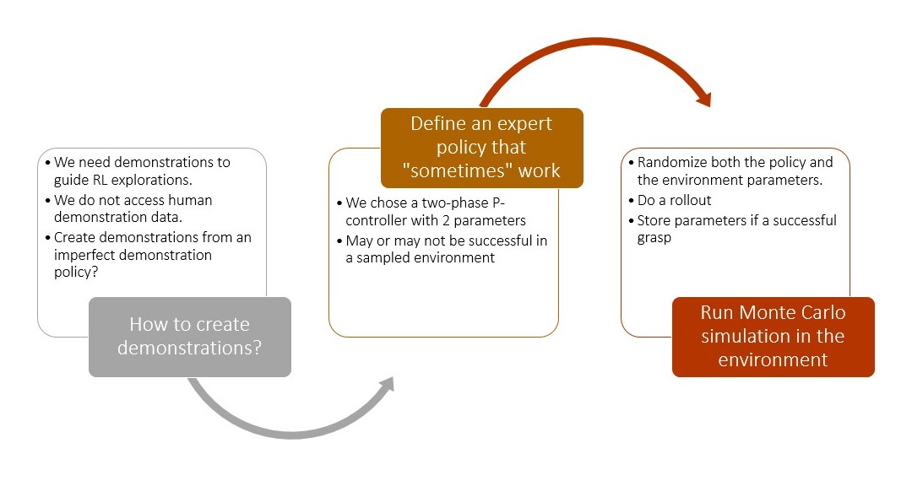
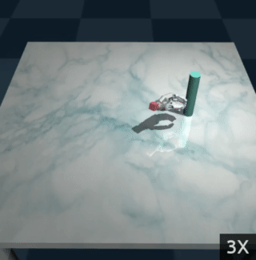
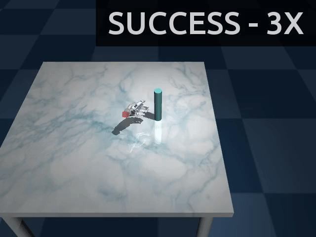
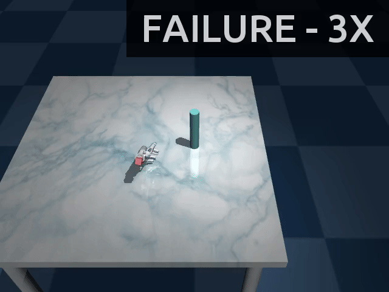

# DEXTRON: DEXTerity enviRONment

DEXTRON (check on [arXiv](https://arxiv.org/abs/2104.12842)) is a stochastic environment with a sparse reward function which simulates a prosthetic hand with real human transport motions. The objective of the environment is to successfully grasp the only object in the environment -- a cylinder. DEXTRON uses real data collected from 9 human subjects:

<p align="center">
  
</p>

## Installation

Install [Digideep](https://github.com/sharif1093/digideep) before usage.

## Replicate RLIL with DUR=0.1

```bash
python -m digideep.main --save-modules "dextron" --params dextron.params.sac_a00 --cpanel '{"time_limit":10.0, "demo_use_ratio":0.1, "batch_size":32, "exclude_obs":["rel_obj_hand_dist", "rel_obj_hand", "distance2", "closure", "timestep"], "generator_type":"real", "number_epochs":3000, "render":false, "database_filename":"./data/session_20201011162549_sweet_cray.csv", "seed":1}' --session-path /tmp/sessions --session-name seed_1
```

## How are environment settings sampled in DEXTRON?

<p align="center">
  
</p>

Every time DEXTRON is instantiated, the real trajectory, its offset, and its duration are sampled. However, for the sampled environment settings there may not be any policies which can achieve the reward. In order to make sure that at least one policy exists for every sampled environment setting, we run a Monte Carlo simulation on a family of parameterized policies. The following figure shows sampled settings for which at least one successful policy exists:

<p align="center">
  
</p>

Now, running DEXTRON with random actions looks like:

<p align="center">
  
</p>


## Results

The current best success rate on DEXTRON is 75% based on Soft Actor-Critic method and learning from demonstrations.

| Success Cases  | Failure Cases |
:-------------------------:|:-------------------------:
 |  |


## Citation

```bibtex
@INPROCEEDINGS{sharif2021dextron,
  title         = "End-to-end grasping policies for human-in-the-loop robots via
                   deep reinforcement learning",
  booktitle     = "2021 {IEEE} International Conference on Robotics and
                   Automation ({ICRA})",
  author        = "Sharif, Mohammadreza and Erdogmus, Deniz and Amato, Christopher and Padir, Taskin",
  publisher     = "IEEE",
  year          =  {2021},
  eprint        =  {2104.12842},
  archivePrefix =  {arXiv},
  primaryClass  =  {cs.RO}
```

## License

BSD 2-clause.
